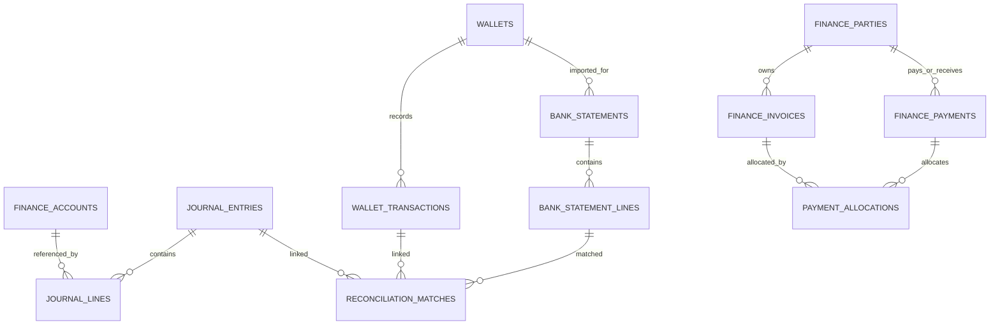
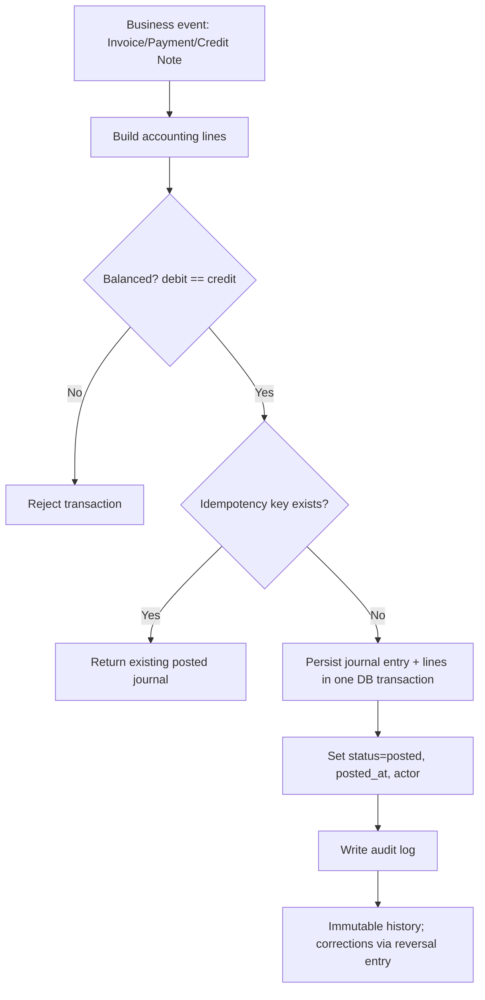

# Finance Trust Layer Report (NestJS + PostgreSQL)

## Scope
This repository uses **NestJS + TypeORM + PostgreSQL**, so the implementation follows NestJS conventions instead of Express while preserving the same API intent (`/api/invoices`, `/api/payments`, etc.).

## 1) Gap Report (Existing vs Required)

### Existing backend assets discovered
- Sales: `backend/src/sales/sales.service.ts`, `backend/src/database/entities/sale.entity.ts`
- Purchases: `backend/src/purchase/purchase.service.ts`, `backend/src/database/entities/purchase.entity.ts`
- Returns: `backend/src/sales-return/sales-return.service.ts`, `backend/src/purchase-return/purchase-return.service.ts`
- Customer payments/deposit ledger: `backend/src/payments/payments.service.ts`, `backend/src/database/entities/payment.entity.ts`
- Expenses: `backend/src/expenses/expenses.service.ts`
- Branch stock operations: `backend/src/branches/branches.service.ts`

### Parity matrix
| Capability | Current repo baseline | Added in this pass | Status |
|---|---|---|---|
| Customer/Supplier party master for finance | Separate `customers` and `suppliers` only | `finance_parties` model + API wiring | ?? Partial |
| Chart of Accounts (IFRS/GAAP style) | Missing | `finance_accounts` + seed endpoint | ?? Partial |
| Double-entry journal | Missing | `journal_entries` + `journal_lines` + posting service | ?? Partial |
| Journal immutability + reversal | Missing | Posting service enforces reversal pattern | ?? Partial |
| Idempotent posting | Missing | Idempotency key fields + service checks | ?? Partial |
| Invoice-level finance docs (SI/PB/CN/DN) | Missing | `finance_invoices` + `/api/invoices` | ?? Partial |
| AR/AP aging report | Missing | `/api/reports/ar-aging` scaffold | ?? Partial |
| Multi-wallet treasury | Missing | `wallets`, `wallet_transactions`, `/api/wallets` | ?? Partial |
| Reconciliation workflow | Missing | statements, lines, matches, reconcile service endpoints | ?? Partial |
| Payment allocation to invoices | Missing | `finance_payments`, `payment_allocations`, `/api/payments` | ?? Partial |
| Credit/Debit note doc model | Partial via returns tables only | `finance_invoices.document_type` includes CN/DN | ?? Partial |
| COGS posting integration | Missing | Posting templates include COGS account mapping | ?? Partial |
| PCI-safe card handling | No explicit guardrail | token/reference-only field + docs/comments | ?? Partial |
| Immutable stock ledger | Partial concept | `stock_ledger` migration + entity introduced | ?? Partial |
| Auditable write history | Partial/limited | `audit_logs` model + writes in finance services | ?? Partial |

### Key missing items after this scaffold
- Automatic event-driven posting from existing Sales/Purchase/Return modules into finance journals.
- Full posting policy for inventory valuation and periodic/perpetual COGS strategy.
- Full reconciliation heuristics + manual review UI workflow.
- Closing process (period locks, retained earnings close entries).
- Complete integration/e2e suite with Postgres containers.

## 2) SQL DDL & Migration Scripts
- Up migration: `backend/sql/migrations/20260213_finance_trust_layer_up.sql`
- Down migration: `backend/sql/migrations/20260213_finance_trust_layer_down.sql`
- Opening balance template: `backend/sql/migrations/20260213_finance_opening_balances_template.sql`

### Highlights in DDL
- New core tables: `finance_accounts`, `journal_entries`, `journal_lines`, `finance_parties`, `finance_invoices`, `finance_payments`, `payment_allocations`, `wallets`, `wallet_transactions`, `bank_statements`, `bank_statement_lines`, `reconciliation_matches`, `idempotency_keys`.
- Existing table extensions: `products`, `sales`, `sale_items`, `sales_returns`, `purchase_returns`.
- Search/performance indexes: `LOWER(sku)`, `LOWER(barcode)`, trigram on product name.

## 3) API Scaffolding (NestJS)
Implemented controllers and services:
- `POST /api/invoices`, `GET /api/invoices`
- `POST /api/payments`, `GET /api/payments`
- `POST /api/wallets`, `GET /api/wallets`
- `POST /api/reconcile/statements/import`
- `GET /api/reconcile/statements/:statementId/suggestions`
- `POST /api/reconcile/match`
- `GET /api/reports/ar-aging`
- `POST /api/accounts/seed-default`, `GET /api/accounts`

Relevant files:
- `backend/src/finance/finance.module.ts`
- `backend/src/finance/*.controller.ts`
- `backend/src/finance/services/*.service.ts`
- `backend/src/finance/dto/*.dto.ts`

Sample JSON payloads are embedded as comments in controllers.

## 4) Posting Logic (Balanced + Idempotent + Immutable)
Core posting service:
- `backend/src/finance/services/journal-posting.service.ts`

Rules enforced:
- Reject unbalanced entries (`sum(debit) != sum(credit)`).
- Idempotency key short-circuits duplicate posting.
- Posted entries are not edited; reversals create mirror entries.

## 5) Reconciliation Workflow
Service:
- `backend/src/finance/services/reconcile.service.ts`

Flow:
1. Import statement batch into `bank_statements` and `bank_statement_lines`.
2. Suggest matches by wallet, amount equality, and date tolerance.
3. Confirm match into `reconciliation_matches` and update line status.

## 6) Testing Templates
Added templates:
- `backend/test/finance/journal-posting.service.spec.ts`
- `backend/test/finance/payment-allocation.integration.spec.ts`
- `backend/test/finance/reconcile.service.spec.ts`
- Jest config: `backend/jest.config.js`

## 7) Legacy Migration Plan
Opening balance and open-document migration template is included in:
- `backend/sql/migrations/20260213_finance_opening_balances_template.sql`

Plan:
1. Seed chart of accounts and party master mappings.
2. Compute cutover trial balance from legacy system.
3. Post one **Opening Balance Journal**.
4. Import open AR/AP documents as `finance_invoices`.
5. Reconcile totals against legacy report before go-live.

## 8) Mermaid Diagrams

### ER diagram

### Posting flow

## 9) Milestone Roadmap (with branch strategy)
| Milestone | Branch | Deliverable | Est. effort |
|---|---|---|---|
| M1 Gap + design docs | `milestone/finance-gap-report` | Gap matrix, ER/flow diagrams, migration design | 0.5 day |
| M2 Schema + SQL migrations | `milestone/finance-schema` | New tables, constraints, indexes, rollback SQL | 1 day |
| M3 API + posting scaffold | `milestone/finance-api-scaffold` | Controllers/services/DTOs and guards | 1.5 days |
| M4 Test templates + hardening | `milestone/finance-tests-template` | Jest config + unit/integration templates | 0.5 day |
| M5 Deep integration | `milestone/finance-integration` | Hook existing sales/purchase/returns to journals | 2-3 days |

## 10) Authoritative References
- IFRS Foundation, Conceptual Framework: https://www.ifrs.org/issued-standards/list-of-standards/conceptual-framework/
- IFRS Foundation, IAS 1 (Presentation of Financial Statements): https://www.ifrs.org/issued-standards/list-of-standards/ias-1-presentation-of-financial-statements/
- NIST SP 800-218 (SSDF): https://csrc.nist.gov/pubs/sp/800/218/final
- NIST SP 800-53A Rev. 5 (assessment controls incl. audit/accountability validation): https://csrc.nist.rip/pubs/sp/800/53/a/r5/final
- PCI SSC FAQ (sensitive authentication data / CVV storage prohibition): https://www.pcisecuritystandards.org/faq/articles/Frequently_Asked_Question/Can-card-verification-codes-values-be-stored-for-card-on-file-or-recurring-transactions
- PCI SSC FAQ (PCI DSS Requirement 3.2 intent): https://www.pcisecuritystandards.org/faq/articles/Frequently_Asked_Question/if-an-organization-does-not-store-sensitive-authentication-data-after-authorization-and-a-particular-business-has-no-need-to-store-the-sensitive-authentication-data-is-the-business-required-to-protect-the-sensitive-authentication-data-in-accordance-with-pci-dss-requirement-3-2/
- PCI SSC Token standards overview: https://www.pcisecuritystandards.org/standards/token-service-provider/
